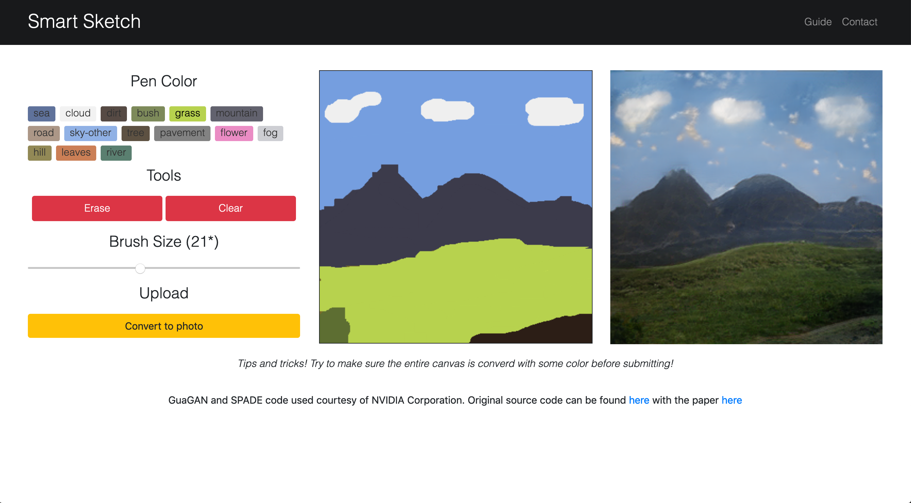

# SmartSketch

## Supercharge your creativity with state of the art image synthesis

### Background

A few months ago, some of us saw [the NVIDIA demo of their GauGAN model](https://www.youtube.com/watch?v=p5U4NgVGAwg&feature=youtu.be) for semantic image synthesis. It blew us away. Unfortunately, unlike their StyleGAN model, they did not quickly release the source code, and everyone was left wanting more of this breakthrough tech.

Fortunately, whilst one group member was playing on their phone on the bus to the hackathon, they noticed a repo called "SPADE" that had just been made public by NVIDIA research on GitHub. It turns out this contained all their code, along with some pretrained models using GauGAN! The repo was made public Friday, April 12th.

For those inclinded, the paper (which has gotten accepted as an oral presentation to CVPR) can be found [here](https://arxiv.org/pdf/1903.07291.pdf).

### Tech description

The user draws an image using given colors. Each of these colors represents a "segment" or type of object being present at that pixel. When they are satisfied with their sketch, they can click a button and the image will be uploaded into the backend of our program hosted on the Google Cloud. The program converts the image to a more readable form and passes it into a folder where we use NVIDIA's pre-trained models to create a synthesized image using learned traits about each texture and object and the pixel map the user submitted. This image is then displayed on the website for the user to see.

...

One thing our program does not do is generate an instance map. The instance map segments the image into different instances of objects - and makes sure that if two of the same object are overlapping each other, they have different pixel values. Detecting and working past overlapping images is a hard problem for computer vision, and this helps generate higher fidelity images. However, we thought that the end user would not enjoy having to sketch another image, and would probably not be submitting very complex drawing with many overlapping figures, so we omitted using this in the model.

### Challenges

- The repo was made public the day we started working on it, so there was not much documentation
- The code had few comments
- The actual running of the model was tightly coupled with their testing function, and would have taken too much time to decouple. This means we had to run a modified version of their testing script to actually use it, which was not desirable.
- Passing files around in the backend is difficult, as the NVIDIA model runs assuming certain directory configurations
- We were going to use react for the frontend but ran into difficulties with the canvas, so had to scrap that at the last minute
- It turns out that there are bugs in the source code for the NVIDIA models, so we could only use the model trained on the COCO dataset - we spent some time trying to debug the other models but saw on GitHub that other people were also having the same issues

### Future Ideas

- Real-time sketches like in the video demo
- More colors and textures
- Hooking into the models deeper, so we do not have to use their testing code to run them
- Evaluating different pre-trained models (ade20k, cityscapes, etc)
- Making the server stateless (save images to a shared file store), run the models on another VM that is dedicated to that (with more GPUs etc)
- Enable better concurrent connections (this comes with running the models natively in our server)

#### Credits

- https://nvlabs.github.io/SPADE/
- https://arxiv.org/abs/1903.07291
- https://github.com/nvlabs/spade/
